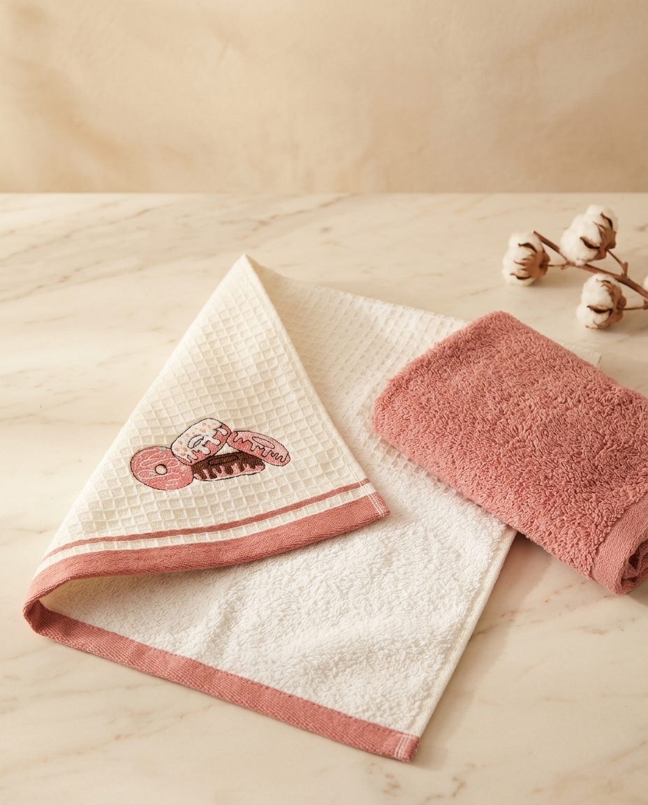
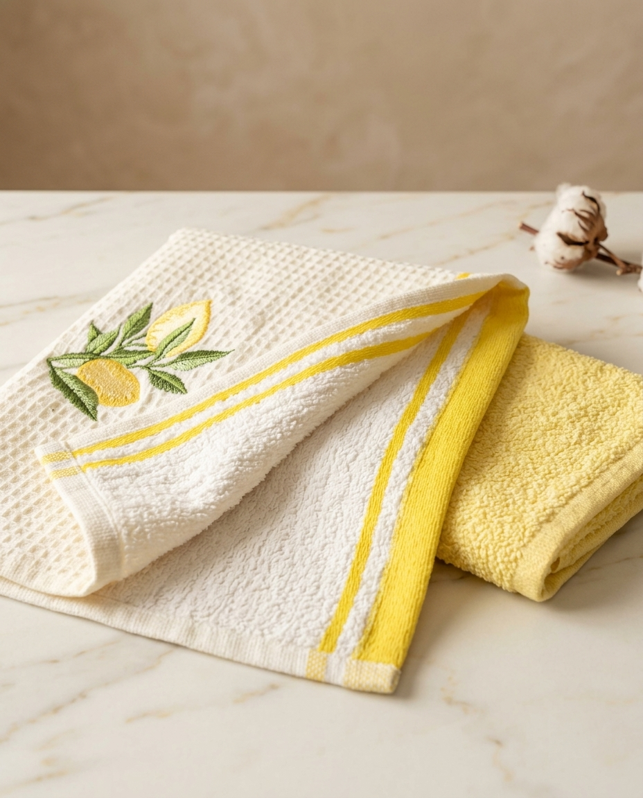
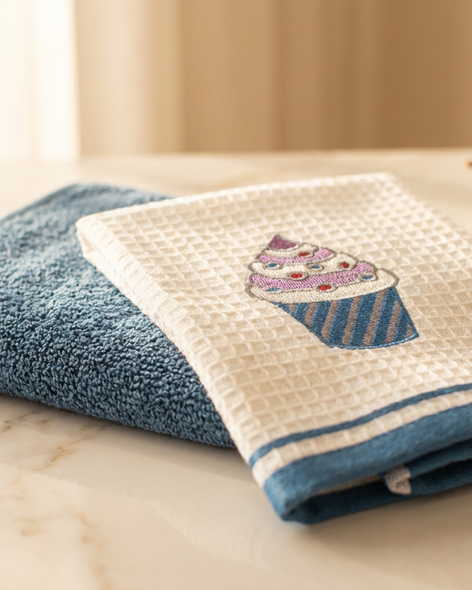

# Social Media Post Skill

Three Claude Code skills I built to automate brand-consistent social media posts for e-commerce stores — from visual identity extraction to AI image generation and quality scoring.

> Tested end-to-end on the [`dolceev-branding`](../../tree/dolceev-branding) branch using real product photos from [@dolceev.store](https://www.instagram.com/dolceev.store/) — a Turkish home textile brand with a Warm Mediterranean Luxury aesthetic.

## Example Outputs

Generated product posts from the Dolceev test run (Gemini Imagen, brand-styled):

| Donut & Cookie Towel Set | Lemon Embroidered Set | Cupcake Waffle Set |
|:---:|:---:|:---:|
|  |  |  |

All three generated against the same `visual-dna.json` — marble surface, cotton branch prop, soft natural side-light, warm amber grade.

---

## The Pipeline

```
/taste-researcher  →  /product-visual-analyzer  →  /post-compatibility-checker
```

### 1. `/taste-researcher`
Analyzes a social media account's posts (screenshots, URLs, or a written description) and extracts its **Visual DNA** — a structured `visual-dna.json` covering color palette, lighting, composition, textures, and mood. This file drives all downstream generation.

### 2. `/product-visual-analyzer`
Takes a product image or URL, analyzes the fabric/material, and generates a photorealistic post styled to the account's Visual DNA. Detects mannequins and human models — in **mannequin mode**, the body shape and pose are locked and only the product + scene change.

Supported providers (in priority order):

| Provider | Type |
|----------|------|
| Gemini Imagen | Free |
| DALL-E 3 | Free / Paid |
| Kling AI (MCP) | Paid |
| Fal AI | Paid |

### 3. `/post-compatibility-checker`
Scores the generated image against the Visual DNA across 5 dimensions (20 pts each):

- **Color Palette** — hex match, forbidden colors, temperature
- **Lighting** — type, warmth, shadow intensity
- **Composition** — negative space, depth of field, framing
- **Textures** — background materials, product texture, props
- **Mood** — brand feel, archetype, feed rhythm

| Score | Decision |
|-------|----------|
| 85–100 | ✓ Approved — ready to post |
| 65–84 | ⚠ Minor revision suggested |
| 0–64 | ✗ Regenerate required |

---

## Visual DNA

`visual-dna.json` is produced by `taste-researcher` and consumed by the other two skills. It captures everything needed to prompt an image generator in the account's style:

```json
{
  "aesthetic": { "name": "Warm Mediterranean Luxury", "mood": "calm" },
  "color_palette": {
    "dominant": ["#FAF8F5", "#D4C5B0", "#E8E4E0"],
    "accent": ["#8B2635", "#C4857A"],
    "forbidden": ["#000000", "#0055FF", "#FF2200"]
  },
  "generation_prompt": {
    "style_prefix": "Warm Mediterranean luxury, dolce vita serenity, soft natural diffused daylight, editorial product photography,",
    "camera_settings": "shot on Sony A7R V, 85mm f/1.8, soft natural side-window light, warm amber grade"
  }
}
```

See [`references/visual-dna-schema.md`](references/visual-dna-schema.md) for the full schema.

---

## File Structure

```
.
├── .claude/skills/
│   ├── taste-researcher/skill.md
│   ├── product-visual-analyzer/skill.md
│   └── post-compatibility-checker/skill.md
├── references/
│   ├── visual-dna-schema.md
│   ├── platform-specs.md
│   └── prompt-generation-guide.md
├── assets/                     # Example generated outputs
├── visual-dna.json             # Created by taste-researcher
└── generated-posts/            # Post images + metadata
```

## Requirements

- [Claude Code](https://claude.ai/code)
- At least one image provider: Gemini API key, OpenAI API key, Kling AI MCP, or `FAL_KEY`
